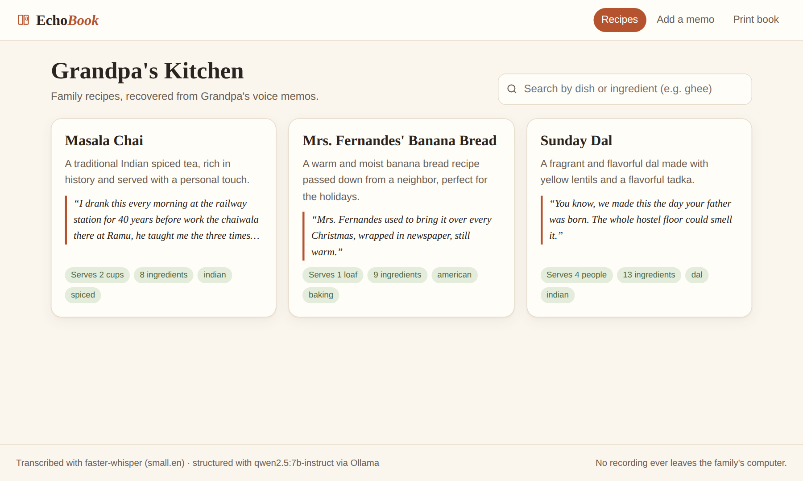
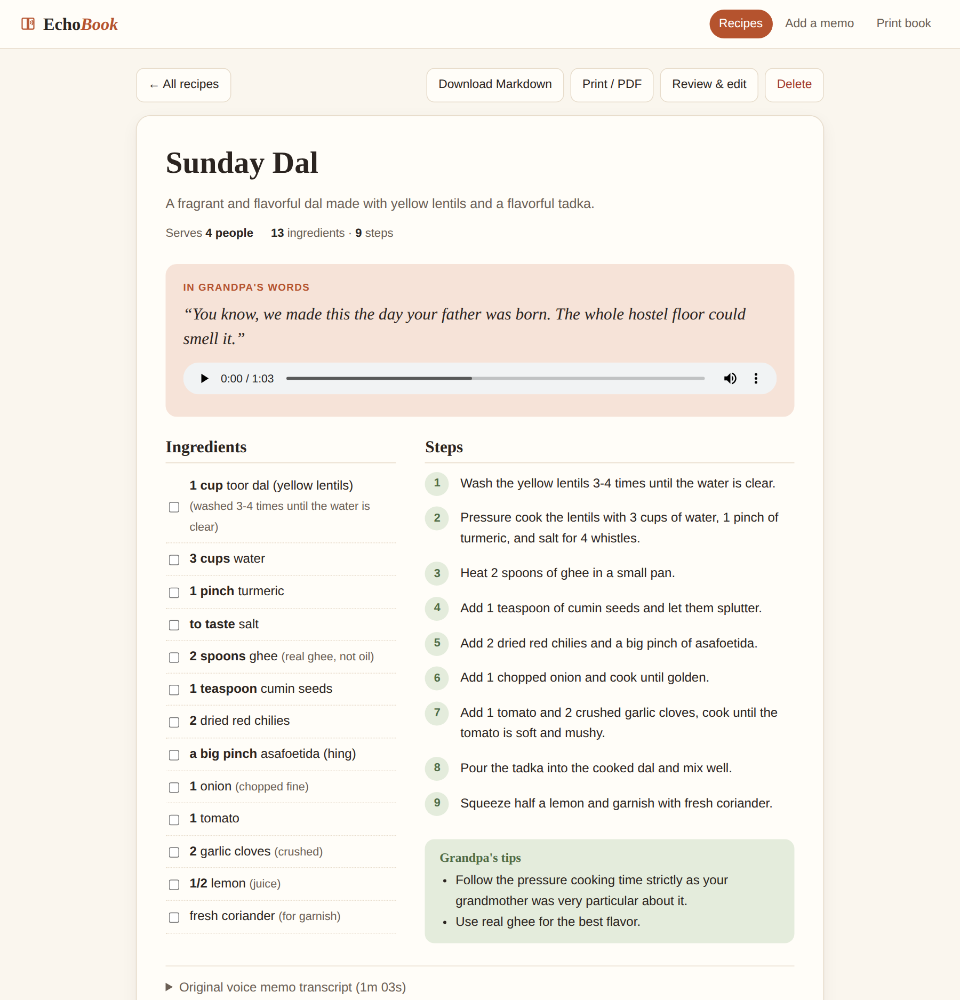
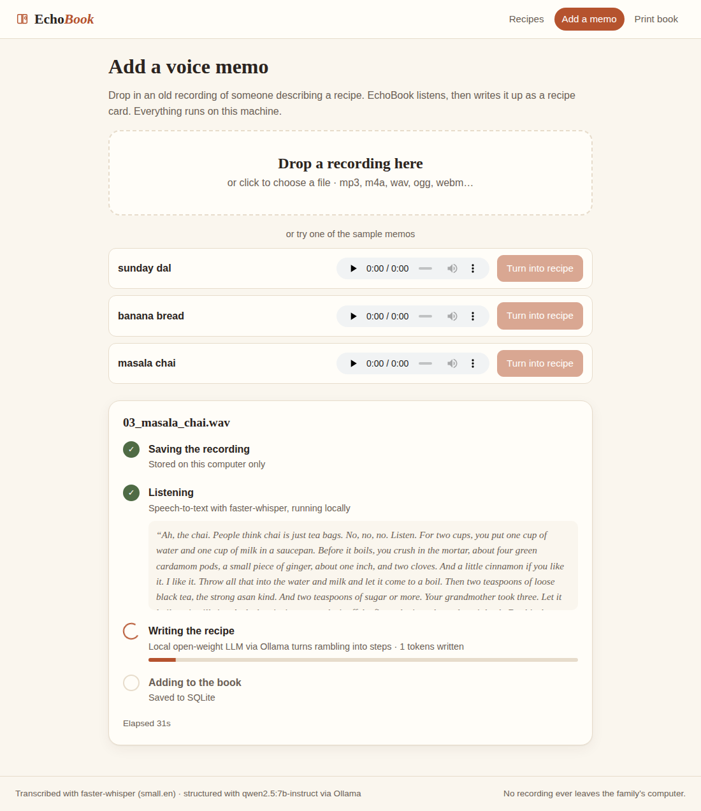

# EchoBook

**Turn family voice memos into a living recipe book, entirely on your own computer.**

My grandfather has years of voice memos describing family recipes from memory. They ramble, there are no
ingredient lists and no steps, and the recipes only exist in his voice, scattered across audio files.
EchoBook takes those recordings and turns them into a clean, searchable, printable recipe book. It keeps
the important part: his own words and the original recording, attached to every recipe.

All processing runs locally on open-weight models. No recording, transcript or family story is sent to a
cloud API, and once the models are downloaded the pipeline works with no internet connection at all.



| A recipe, with Grandpa's own words and the original recording | The local pipeline, stage by stage |
|---|---|
|  |  |

## Features

- **Drop in a voice memo** (mp3, m4a, wav, ogg, webm…) or pick a sample, and watch each stage run live:
  saving → listening (speech-to-text, with a progress bar and live transcript) → writing the recipe →
  adding it to the book.
- **Recipe cards**: title, servings, ingredient list with quantities exactly as spoken, numbered steps,
  and the storyteller's own tips.
- **"In Grandpa's words"**: a verbatim quote of the personal story behind each dish (who taught it, when it
  was made), shown next to an audio player with the original recording.
- **Review & edit**: small models occasionally mishear, so every recipe can be checked against the
  recording and corrected before the book is shared.
- **Search** by dish or ingredient ("ghee", "cardamom"), with matching ingredients highlighted.
- **Export**: download any recipe or the whole book as Markdown, or open the print layout (cover, table
  of contents, one recipe per page) and save it as a PDF.
- **Shareable read-only copy** deployed on Render: relatives can browse the book and listen to the
  recordings, while all processing stays at home.

## How it works

```
                  ┌──────────────────────── family computer (offline-capable) ───────────────────────┐
 voice memo  ──►  │ 1. faster-whisper        2. Ollama + qwen2.5:7b        3. SQLite                 │
 (.m4a/.wav)      │    open-weight Whisper ─►   JSON-schema-constrained ─►   recipes + transcript   │
                  │    small.en, on-device      recipe extraction              + link to audio      │
                  │                                                              │                  │
                  │    FastAPI + single-page UI  (ECHOBOOK_MODE=local)            ▼                  │
                  │                                                    data/recipes.json + data/audio│
                  └──────────────────────────────────────────────────────────────┬──────────────────┘
                                                                   git push      │  (finished recipes only)
                                                                                 ▼
                                                   Render: same FastAPI app, ECHOBOOK_MODE=viewer
                                                   read-only browse / search / listen / print
```

1. **Speech-to-text: [faster-whisper](https://github.com/SYSTRAN/faster-whisper)** runs OpenAI's
   open-weight Whisper (`small.en` by default) on CTranslate2 with int8 on CPU or float16 on a GPU. VAD
   filtering skips silence, and an initial prompt biases it toward kitchen vocabulary (ghee, asafoetida,
   cardamom…). See `app/transcribe.py`.
2. **Structuring: [Ollama](https://ollama.com) + `qwen2.5:7b-instruct`** (Apache-2.0, open weights). The
   transcript is sent to the local model with a carefully tuned archivist prompt, and Ollama's
   **structured outputs** constrain decoding to a JSON schema (title, servings, ingredients with
   quantity/item/note, steps, tips, story quote, tags), so the output always parses. The prompt forbids
   invented quantities, times and advice, and makes the model copy amounts exactly as spoken. After
   generation, the story quote is snapped back onto the closest real span of the transcript so the "in
   their own words" section is always authentic. See `app/structure.py`.
3. **Storage: SQLite** (`data/echobook.db`) holds each recipe, its full transcript, the source audio file
   and which models produced it. Every change is mirrored to `data/recipes.json`, a diffable snapshot that
   gets committed and deployed.
4. **Web app: FastAPI + plain HTML/CSS/JS** with no build step and no framework. Long pipeline runs happen
   in a background worker, and the UI polls `/api/jobs/{id}` for stage, progress and token counts.

### Why the local / cloud split?

GPU inference doesn't fit on Render's free tier, and it shouldn't run in the cloud anyway, because the
point is that family recordings stay home. So the same codebase runs in two modes:

| | `ECHOBOOK_MODE=local` (home) | `ECHOBOOK_MODE=viewer` (Render) |
|---|---|---|
| Upload & process memos | ✅ faster-whisper + Ollama | ❌ disabled (403) |
| Browse, search, listen, export | ✅ | ✅ |
| Dependencies | `requirements.txt` (includes faster-whisper) | `requirements-web.txt` (FastAPI only) |
| Data | SQLite, mirrored to `data/recipes.json` | SQLite rebuilt from `data/recipes.json` at boot |

Publishing new recipes: process memos at home, review them, then `git commit data/ && git push`. Render
auto-deploys the updated book.

## Run it locally

Requirements: Python 3.10+, [Ollama](https://ollama.com/download). A GPU is optional: on a 12-core CPU a
one-minute memo takes about 2 minutes end to end with the 7B model (~15 s to transcribe, the rest to
structure), or about half that with `qwen2.5:3b-instruct`. On a GPU the whole pipeline takes seconds.
If your machine has only a small GPU, set `OLLAMA_NUM_GPU=0`. A partial offload onto a weak GPU was 6x
slower at prompt processing than pure CPU in my tests.

```bash
git clone https://github.com/Anandpiyush21/EchoBook.git && cd EchoBook
python3 -m venv .venv && source .venv/bin/activate
pip install -r requirements.txt

ollama pull qwen2.5:7b-instruct      # one-time download (~4.7 GB); or qwen2.5:3b-instruct for speed
cp .env.example .env                 # optional: change models, storyteller name, book title

uvicorn app.main:app --port 8000
# open http://localhost:8000  →  "Add a memo"  →  pick a sample  →  "Turn into recipe"
```

The first transcription downloads the Whisper model (~500 MB) from Hugging Face. No token is needed.
After that, set `HF_HUB_OFFLINE=1`, unplug the network, and the whole pipeline still works.

**Using a GPU** (e.g. an RTX A6000): Ollama uses CUDA automatically. For Whisper, install the CUDA
libraries faster-whisper needs (`pip install nvidia-cublas-cu12 nvidia-cudnn-cu12`) and set
`WHISPER_MODEL=large-v3` and `OLLAMA_MODEL=qwen2.5:14b-instruct` for the best quality.

## Deploy the viewer on Render

1. Push this repo to GitHub (the processed recipes in `data/` included).
2. In Render: **New → Blueprint**, select the repo. `render.yaml` creates a free Python web service with
   `ECHOBOOK_MODE=viewer`.
3. Every push to `main` redeploys. New recipes processed at home show up after `git push`.

The viewer installs only FastAPI and uvicorn, so builds take seconds and fit the free tier. (Free
instances sleep when idle, so the first visit can take ~30 s to wake.)

## Project layout

```
app/
  main.py          FastAPI routes (recipes, search, export, upload/sample processing, job status)
  transcribe.py    stage 1: faster-whisper speech-to-text
  structure.py     stage 2: Ollama prompt + JSON schema + output cleaning / verbatim-quote check
  pipeline.py      background worker, per-stage job progress
  db.py            stage 3: SQLite store, mirrored to data/recipes.json
  export.py        Markdown export
  config.py        env-driven settings (.env supported)
frontend/          index.html, app.js, style.css (single-page app, no build step)
sample_audio/      three stand-in voice memos (see below)
data/              recipes.json snapshot + audio for the deployed book
scripts/
  eval_structuring.py   iterate on the prompt/model without re-transcribing; flags hallucinated quantities
  make_sample_audio.py  regenerate the stand-in memos with Piper TTS
render.yaml        Render Blueprint (viewer mode)
demo_script.md     step-by-step live demo
```

## About the sample memos

`sample_audio/` holds three rambling, unscripted-sounding memos (Sunday dal, banana bread, masala chai),
written in the style of my grandfather's recordings and voiced with [Piper](https://github.com/rhasspy/piper),
an open-source local TTS (`scripts/make_sample_audio.py`), so the demo works without sharing private family
audio. They include the things real memos have: false starts, asides, a bit of family history and loose
measurements ("a big pinch of hing"). Drop in real recordings and they work the same way.

## Prompt-tuning notes

`scripts/eval_structuring.py` re-runs only the structuring step over cached transcripts and flags any
ingredient quantity whose numbers never appear in the transcript. Findings that shaped the prompt:

- `qwen2.5:3b` was fast but invented details (a "30 minutes" total time, a "don't over-mix" tip on a dal)
  and changed amounts (1 tsp → ½ tsp). `qwen2.5:7b` with the tightened prompt copied amounts exactly and
  left unknown fields empty.
- Giving the model an example ASR correction involving "Assam" made it name unrelated dishes "Assam …".
  The examples in a prompt leak, so they have to be chosen carefully.
- Small models paraphrase "verbatim" quotes, hence the fuzzy snap-back onto the real transcript.

## License

MIT
